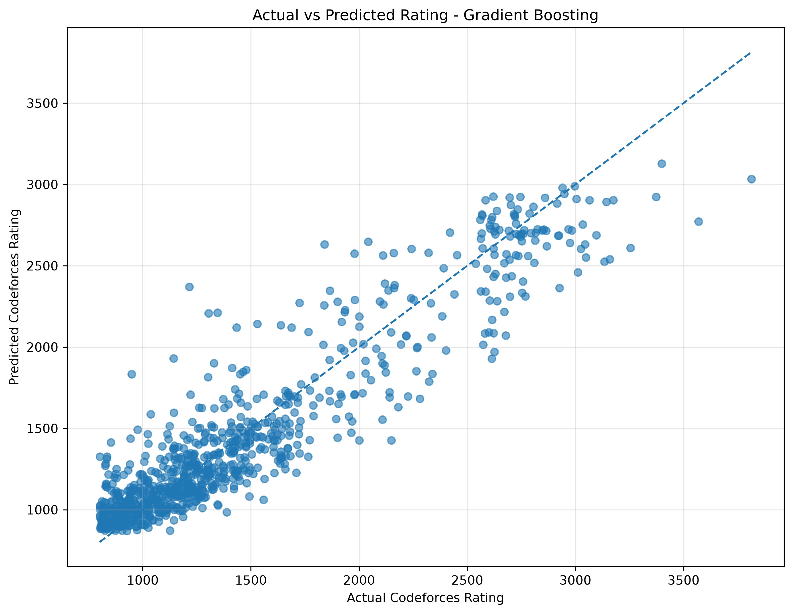
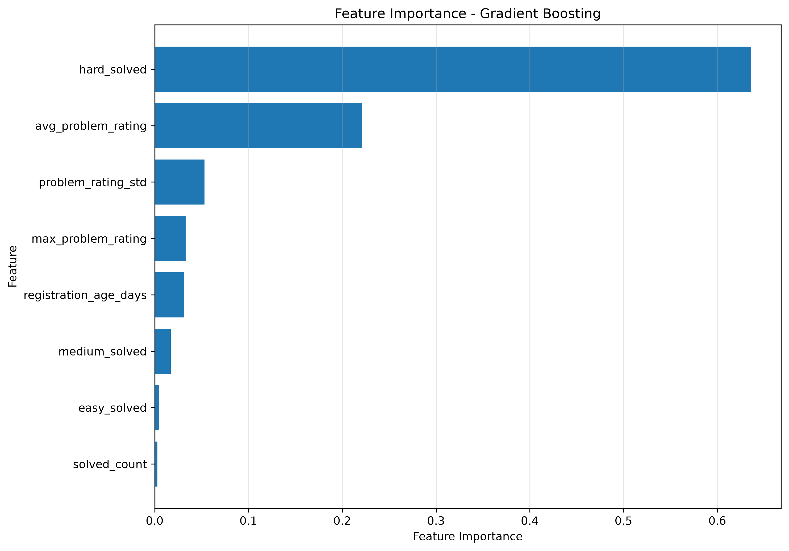

# Codeforces Rating Predictor

A machine learning-based web application that predicts a Codeforces user's rating from their problem-solving history and Codeforces profile data.

The application fetches live user data from the Codeforces API, performs feature engineering, and uses a trained regression model to estimate the user's expected rating.

---

## 🚀 Project Overview

The **Codeforces Rating Predictor** analyzes a programmer's problem-solving behavior and estimates their Codeforces rating using machine learning.

Instead of relying on manually entered information, the application accepts a **Codeforces username**, retrieves the user's recent submission history through the Codeforces API, extracts relevant features, and generates a rating prediction.

The project includes:

- Data preprocessing
- Feature engineering
- Multiple regression models
- Model comparison
- Model evaluation
- Feature importance analysis
- Live Codeforces API integration
- Flask-based web interface
- Support for both rated and unrated users

---

## ✨ Features

### 🔮 Rating Prediction
Enter a Codeforces username and receive an estimated rating based on the user's problem-solving history.

### 📡 Live Codeforces Data
The application retrieves user information and accepted submissions directly from the Codeforces API.

### 🧠 Machine Learning
Three regression algorithms were trained and compared:

- Linear Regression
- Random Forest Regressor
- Gradient Boosting Regressor

### 🛠️ Feature Engineering

The model uses 8 features:

1. Average problem rating
2. Number of rated problems solved
3. Maximum problem rating solved
4. Easy problems solved
5. Medium problems solved
6. Hard problems solved
7. Standard deviation of problem ratings
8. Account age in days

### 📊 Model Evaluation

The models are evaluated using:

- MAE — Mean Absolute Error
- RMSE — Root Mean Squared Error
- R² — Coefficient of Determination

### 📈 Visual Analytics

The project generates:

- Actual vs Predicted Rating visualization
- Feature Importance visualization

### 👤 Unrated User Support

Users without a current Codeforces rating are handled gracefully. Their predicted rating is displayed while the actual rating and prediction error are shown as unavailable.

---

## 🧠 Machine Learning Pipeline

```text
Codeforces Dataset
        │
        ▼
Data Preprocessing
        │
        ▼
Feature Engineering
        │
        ▼
Train / Test Split
        │
        ▼
Model Training
        │
        ├── Linear Regression
        │
        ├── Random Forest
        │
        └── Gradient Boosting
        │
        ▼
Model Evaluation
        │
        ▼
Gradient Boosting Model
        │
        ▼
Saved Model
        │
        ▼
Live Codeforces API
        │
        ▼
Feature Extraction
        │
        ▼
Rating Prediction
        │
        ▼
Flask Web Application
```

---

## 📊 Model Performance

The dataset contains **4,417 Codeforces users**.

The data was divided into:

- 80% training data
- 20% testing data

### Model Comparison

| Model | MAE | RMSE | R² |
|---|---:|---:|---:|
| Linear Regression | 183.04 | 260.95 | 0.8152 |
| Random Forest | 164.26 | 228.26 | 0.8586 |
| **Gradient Boosting** | **162.91** | **223.70** | **0.8642** |

Gradient Boosting was selected using **MAE as the primary model-selection metric**.

The final saved model is therefore a **Gradient Boosting Regressor**.

### What the metrics mean

**MAE — 162.91**

On average, the predicted rating differs from the actual rating by approximately 163 rating points on the evaluation set.

**RMSE — 223.70**

RMSE gives greater weight to larger prediction errors and provides another measure of prediction accuracy.

**R² — 0.8642**

The model explains approximately 86.4% of the variation in the target ratings in this evaluation split.

---

## 🔍 Feature Importance

The Gradient Boosting model produced the following feature importance values:

| Feature | Importance |
|---|---:|
| Hard problems solved | 63.61% |
| Average problem rating | 22.12% |
| Problem rating standard deviation | 5.31% |
| Maximum problem rating | 3.30% |
| Registration age | 3.16% |
| Medium problems solved | 1.72% |
| Easy problems solved | 0.46% |
| Rated problems solved | 0.31% |

The results show that **hard problems solved** has the largest contribution among the engineered features, followed by **average problem rating**.

> Feature importance indicates how much a feature contributes to the model's predictions. It does not by itself establish a causal relationship.

---

## 📈 Model Visualizations

### Actual vs Predicted Rating

This visualization compares the actual Codeforces ratings with the ratings predicted by the Gradient Boosting model.



Points closer to the diagonal reference line represent predictions closer to the corresponding actual ratings.

---

### Feature Importance

The feature importance visualization shows the relative contribution of each feature to the Gradient Boosting model.



---

## 🖥️ Application Screenshots

### Rated User

The application displays the user's Codeforces profile information together with the predicted rating and prediction error.


### Unrated User

Users without a current Codeforces rating are handled without crashing the application.


> If these two screenshot files are not currently present in the `Images` folder, remove these two screenshot sections for now. We can add the screenshots later.

---

## 🛠️ Tech Stack

### Programming Language
- Python

### Machine Learning
- Scikit-learn
- NumPy
- Joblib

### Data Visualization
- Matplotlib

### Backend
- Flask
- Flask-CORS
- Flask-Caching

### API
- Codeforces API

### Frontend
- HTML
- CSS
- Jinja2 Templates

---

## 📁 Project Structure

```text
Codeforces-Rating-Predictor/
│
├── Images/
│   ├── actual_vs_predicted.png
│   └── feature_importance.png
│
├── Model/
│   ├── data.json
│   ├── model.py
│   ├── model_backup.py
│   ├── predict.py
│   ├── train_model.py
│   ├── evaluate_model.py
│   └── regression_model.pkl
│
├── static/
│   └── css/
│
├── templates/
│   ├── index.html
│   └── result.html
│
├── app.py
├── requirements.txt
├── README.md
└── vercel.json
```

---

## ⚙️ Installation

### 1. Clone the repository

```bash
git clone <YOUR-GITHUB-REPOSITORY-URL>
```

### 2. Navigate to the project

```bash
cd Codeforces-Rating-Predictor
```

### 3. Create a virtual environment

```bash
python -m venv venv
```

### 4. Activate the virtual environment

#### Windows PowerShell

```powershell
.\venv\Scripts\Activate.ps1
```

#### Windows Command Prompt

```cmd
venv\Scripts\activate
```

### 5. Install dependencies

```bash
pip install -r requirements.txt
```

---

## ▶️ Running the Application

Start the Flask application:

```bash
python app.py
```

The application will run locally at:

```text
http://127.0.0.1:5000
```

Open the URL in your browser and enter a Codeforces username.

---

## 🧪 Running Model Training

To retrain the machine learning models:

```bash
python Model/train_model.py
```

The training script:

1. Loads the Codeforces dataset
2. Performs feature engineering
3. Splits the data into training and testing sets
4. Trains three regression models
5. Calculates MAE, RMSE and R²
6. Selects the model with the lowest MAE
7. Saves the selected model to:

```text
Model/regression_model.pkl
```

---

## 📊 Running Model Evaluation

To generate evaluation metrics and visualizations:

```bash
python Model/evaluate_model.py
```

This generates:

```text
Images/actual_vs_predicted.png
Images/feature_importance.png
```

---

## 🔄 Live Prediction Workflow

When a user enters a Codeforces username:

```text
Username
   ↓
Codeforces API
   ↓
Accepted Submissions
   ↓
Problem Rating Distribution
   ↓
Feature Engineering
   ↓
8 Model Features
   ↓
Gradient Boosting Model
   ↓
Predicted Rating
   ↓
Flask Result Page
```

---

## 🧩 Example

For example, when testing the application with the Codeforces user `tourist`, the application retrieves the live profile and submission information and produces an estimated rating.

The predicted rating changes as the user's Codeforces activity changes because the application uses live API data.

---

## 🔐 API Handling

The application includes handling for common API-related problems:

- Invalid usernames
- API connection failures
- Request timeouts
- Invalid API responses
- Users without ratings
- Missing profile information

---

## 🚀 Future Improvements

Possible future improvements include:

- Use a larger and more frequently updated dataset
- Add recent contest performance as a feature
- Add contest rating change history
- Add rating trend prediction
- Add interactive performance charts
- Add prediction confidence intervals
- Improve model calibration
- Add automated dataset updates
- Deploy the upgraded version publicly

---

## 📌 Disclaimer

The predicted rating is a machine learning estimate and should not be interpreted as an official Codeforces rating or guaranteed future rating.

---

## 👩‍💻 Author

**Nidhi Mittal**

GitHub:  
https://github.com/NidhiMittal02/

LinkedIn:  
https://www.linkedin.com/in/nidhi-mittal-976396295/